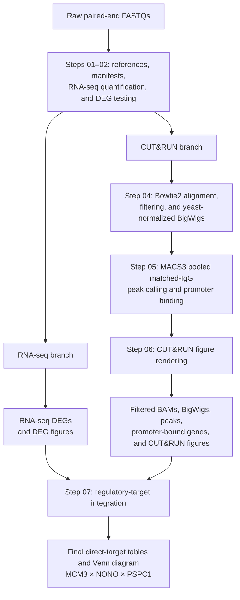

<h1 style="font-family: Arial, Helvetica, sans-serif; font-size: 2.2em; line-height: 1.2; color: #17365d; margin-bottom: 0.15em;">MCM3–NONO–PSPC1 Multi-omics Pipeline</h1>

<p style="font-family: Arial, Helvetica, sans-serif; font-size: 1.05em; line-height: 1.6; color: #4b5563;"><em>A reproducible workflow integrating CUT&amp;RUN chromatin profiling with bulk RNA-seq differential expression to define direct regulatory targets.</em></p>

[](pipeline/environment.yml)
[](pipeline/environment.yml)
[](#visual-abstract)

> **Path convention.** `<PROJECT_ROOT>` denotes the directory containing a local clone of this repository. `<PIPELINE_ROOT>` is `<PROJECT_ROOT>/pipeline`. Replace these placeholders with local paths; no workstation- or drive-specific path is assumed.

## Overview

This workflow characterizes the chromatin occupancy and transcriptional consequences of the MCM3, NONO, and PSPC1 complex. It uses paired-end CUT&RUN data with matched IgG controls and yeast spike-in normalization, then integrates factor-specific promoter binding with bulk RNA-seq differential-expression results. A direct regulatory target is a gene supported by both promoter binding and differential expression in the corresponding perturbation.

### Core analytical capabilities

- **CUT&RUN processing:** independent mouse (`mm10`) and yeast (`sacCer3`) alignment, quality filtering, duplicate handling, and paired-fragment coverage generation.
- **Spike-in normalization:** mouse coverage is scaled to 10,000 retained yeast read pairs per library, providing a common signal scale across libraries.
- **Matched-IgG binding assessment:** promoter binding requires a qualifying pooled matched-IgG peak plus a factor-to-IgG coverage ratio of at least 2 in each of two biological replicates.
- **Regulatory-target integration:** promoter-bound genes are intersected with bulk RNA-seq DEGs, enabling factor-specific and shared target-set analyses.

## Visual abstract



The RNA-seq and CUT&amp;RUN branches converge at Step 07, where factor-matched DEG evidence is integrated with promoter-binding evidence.

| Step | Script | Purpose | Principal products |
| --- | --- | --- | --- |
| 04 | `scripts/CUT&RUN/04_align_and_normalize.py` | Align, filter, yeast-normalize, and generate signal tracks. | Filtered BAMs; replicate, mean, and IGV BigWigs; normalization manifest. |
| 05 | `scripts/CUT&RUN/05_call_peaks_and_define_binding.py` | Call matched-IgG peaks and test promoter-level factor/IgG support. | Peak sets; promoter-bound genes; supporting BED/TSV evidence. |
| 06 | `scripts/CUT&RUN/06_render_figures.py` | Render CUT&RUN coverage and peak-focused figures. | Metaprofiles, overlap figures, peak-distribution panels, and publication images. |
| 07 | `scripts/regulatory_target/07_define_regulatory_targets.py` | Intersect binding evidence with RNA-seq DEGs. | Regulatory-target tables, Venn diagrams, directional summaries, and target metaprofiles. |

## Repository layout

```text
<PROJECT_ROOT>/
├── pipeline/
│   ├── environment.yml                # Versioned Conda environment specification
│   ├── scripts/                       # Analysis stages and rendering helpers
│   ├── reference/                     # References and generated indexes
│   ├── deg_work/                      # RNA-seq quantification, DEG tables, and figures
│   ├── cutrun_work/                   # CUT&RUN BAMs, BigWigs, peaks, and figures
│   └── regulatory_work/               # Direct-target tables and regulatory figures
├── bulkRNAseq_data/                   # Raw RNA-seq data (user supplied)
└── CUT&RUN_data/                      # Raw CUT&RUN data (user supplied)
```

## Requirements

### Compute resources

Raw reconstruction is intended for Linux or macOS and benefits from 16 CPU cores, at least 32 GB RAM, and sufficient local storage for FASTQs, alignment BAMs, signal tracks, and figures. Storage requirements depend on sequencing depth; retain substantially more free space than the combined compressed FASTQ size.

### Software

The version-controlled environment in [`pipeline/environment.yml`](pipeline/environment.yml) specifies the supported software stack, including:

- Python 3.11 with `pandas`, `pyBigWig`, `numpy`, and `matplotlib`.
- R 4.4 with `data.table`, `dplyr`, `ggplot2`, `edgeR`, `limma`, `tximport`, and annotation packages.
- Bowtie2, SAMtools, Picard, BEDTools, MACS3, UCSC `bedGraphToBigWig`, deepTools, Salmon, and HISAT2.

## Installation

1. Install [Conda](https://docs.conda.io/) or [Mamba](https://mamba.readthedocs.io/) for the target platform.
2. Clone the repository and define its local root.

   ```bash
   git clone <REPOSITORY_URL> mcm3-project-analysis-pipeline
   cd mcm3-project-analysis-pipeline
   export PROJECT_ROOT="$(pwd)"
   ```

3. Create and activate the declared environment.

   ```bash
   mamba env create -f pipeline/environment.yml
   conda activate mcm3-pipeline
   ```

   If Mamba is unavailable, replace `mamba` with `conda`. On Apple Silicon, use a platform-compatible Conda configuration and verify every executable below before running a full reconstruction.

4. Verify the executables required by the CUT&RUN stages.

   ```bash
   command -v bowtie2 samtools bedtools bedGraphToBigWig macs3 computeMatrix plotProfile Rscript
   python -c "import pandas, pyBigWig; print('Python dependencies available')"
   ```

5. Place raw data in the expected sibling directories, or use the accepted-intermediate route described below. Step 01 creates the sample manifests and reference resources required by later stages.

## Running the pipeline

### Recommended: dependency-aware full run

From `<PIPELINE_ROOT>`, a raw-data reconstruction is launched as follows:

```bash
cd <PROJECT_ROOT>/pipeline
nohup python scripts/run_pipeline.py --source raw --step all --threads 16 &
```

The launcher executes upstream input preparation and RNA-seq analysis before the CUT&RUN and regulatory stages.

### Stagewise run: CUT&RUN and regulatory analysis

Run the commands below **sequentially** after upstream manifests, references, and RNA-seq DEG tables have been created. Wait for a stage to finish successfully before submitting the next stage.

#### Step 04 — align and normalize CUT&RUN

```bash
nohup python scripts/CUT\&RUN/04_align_and_normalize.py --from-raw --threads 16 &
```

This stage aligns mouse and yeast reads, produces filtered BAMs, applies yeast-spike-in normalization, and writes replicate and mean BigWigs. A chromosome with no stored BigWig intervals is handled as zero coverage during mean-track generation.

#### Step 05 — call peaks and define promoter binding

```bash
nohup python scripts/CUT\&RUN/05_call_peaks_and_define_binding.py --from-raw &
```

This stage calls pooled factor peaks against matched pooled IgG, evaluates promoter overlap, and requires factor-to-IgG coverage support in both biological replicates.

#### Step 06 — render CUT&RUN figures

```bash
nohup python scripts/CUT\&RUN/06_render_figures.py &
```

This stage uses deepTools matrices and the display-scaled mean BigWigs to create profile, overlap, and peak-distribution figures.

#### Step 07 — define regulatory targets

```bash
nohup python scripts/regulatory_target/07_define_regulatory_targets.py &
```

This stage intersects promoter-bound gene sets with RNA-seq DEGs and produces direct-target tables, overlap diagrams, and metaprofiles.

### Accepted-intermediate route

When validated accepted intermediates are already packaged in the expected workspace paths, run the pipeline with `--source accepted`. This route validates required intermediates rather than rebuilding the raw CUT&RUN alignment and normalization stages. It is not a substitute for raw-data reconstruction when those intermediates are absent.

```bash
nohup python scripts/run_pipeline.py --source accepted --step all --threads 16 &
```

## Key parameters and quality criteria

| Analysis layer | Implemented criterion |
| --- | --- |
| Mouse read retention | Properly paired, primary mouse alignments with MAPQ ≥ 30. |
| Yeast normalization | Mouse paired-fragment coverage per 10,000 retained yeast read pairs. |
| Peak calling | Pooled two-replicate factor BAMPE against pooled matched IgG using MACS3. |
| Peak retention | Direct `q ≤ 0.05` and fold enrichment ≥ 3. |
| Promoter window | GENCODE M25 transcription start site ±1,000 bp. |
| Peak/promoter overlap | At least 250 bp. |
| Binding support | Factor/IgG mean coverage ratio ≥ 2 in both biological replicates. |
| DEG threshold | Benjamini–Hochberg FDR ≤ 0.05 and absolute log2 fold change ≥ 0.28. |

## Outputs and interpretation

| Workspace | Contents |
| --- | --- |
| `<PIPELINE_ROOT>/cutrun_work/03_bigwig/` | Library-level normalized tracks, factor means, and display-scaled IGV tracks. |
| `<PIPELINE_ROOT>/cutrun_work/05_promoters/` | Final promoter-bound gene sets and replicate-level support tables. |
| `<PIPELINE_ROOT>/cutrun_work/visuals/` | CUT&RUN coverage, metaprofile, Venn, and peak-distribution figures. |
| `<PIPELINE_ROOT>/regulatory_work/data/` | Direct-target gene lists, direction tables, and overlap counts. |
| `<PIPELINE_ROOT>/regulatory_work/visuals/` | Regulatory-target Venn diagrams, composition plots, and metaprofiles. |

The regulatory-target output is an analytical integration result, not evidence of mechanism in isolation. Interpret factor-specific expression directions in the context of the documented perturbation contrast, the peak and ratio thresholds, the GENCODE M25 reference, and the biological replication represented in the input data.

## Reproducibility and troubleshooting

- Preserve `environment.yml`, the exact command line, script revision, and generated manifests with each analysis release.
- Do not delete filtered BAMs or replicate BigWigs before Step 05; do not delete display-scaled mean BigWigs before Steps 06–07.
- Confirm that raw FASTQ names satisfy the sample-manifest parsing rules before beginning a raw reconstruction.
- If a stage fails, correct the reported prerequisite before restarting that stage.
- Existing outputs are reused by selected stages where the script explicitly detects completed files. For a scientifically independent rerun, archive or rename prior outputs deliberately before rerunning the workflow.

## Citation

### Cite this workflow

No release DOI or formal pipeline citation metadata is currently distributed with this repository. Before manuscript submission or public release, add a `CITATION.cff` file and replace the placeholders below with the approved authorship, version, archival DOI, and access date.

```bibtex
@software{mcm3_nono_pspc1_pipeline,
  author  = {<AUTHORS>},
  title   = {MCM3--NONO--PSPC1 multi-omics pipeline},
  version = {<RELEASE_VERSION_OR_COMMIT>},
  url     = {<REPOSITORY_URL>},
  year    = {<YEAR>}
}
```

### Cite the principal software

1. Langmead B, Salzberg SL. Fast gapped-read alignment with Bowtie 2. *Nature Methods*. 2012;9:357–359. doi: [10.1038/nmeth.1923](https://doi.org/10.1038/nmeth.1923).
2. Li H, et al. The Sequence Alignment/Map format and SAMtools. *Bioinformatics*. 2009;25:2078–2079. doi: [10.1093/bioinformatics/btp352](https://doi.org/10.1093/bioinformatics/btp352).
3. Quinlan AR, Hall IM. BEDTools: a flexible suite of utilities for comparing genomic features. *Bioinformatics*. 2010;26:841–842. doi: [10.1093/bioinformatics/btq033](https://doi.org/10.1093/bioinformatics/btq033).
4. Zhang Y, et al. Model-based Analysis of ChIP-Seq (MACS). *Genome Biology*. 2008;9:R137. doi: [10.1186/gb-2008-9-9-r137](https://doi.org/10.1186/gb-2008-9-9-r137).
5. Ramírez F, et al. deepTools2: a next generation web server for deep-sequencing data analysis. *Nucleic Acids Research*. 2016;44:W160–W165. doi: [10.1093/nar/gkw257](https://doi.org/10.1093/nar/gkw257).
6. Patro R, et al. Salmon provides fast and bias-aware quantification of transcript expression. *Nature Methods*. 2017;14:417–419. doi: [10.1038/nmeth.4197](https://doi.org/10.1038/nmeth.4197).
7. Law CW, et al. voom: precision weights unlock linear model analysis tools for RNA-seq read counts. *Genome Biology*. 2014;15:R29. doi: [10.1186/gb-2014-15-2-r29](https://doi.org/10.1186/gb-2014-15-2-r29).

## License

No license file is currently present in this repository. Therefore, no permission to reuse, modify, or redistribute the code should be inferred. Before public release, repository maintainers should select an appropriate license, add a `LICENSE` file at the repository root, and update this section and any release metadata to match.
